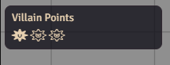
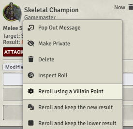

# PF2e Villain Points
A module for Pathfinder 2e (and Starfinder) system for Foundry VTT.  
Add Villain points that the GM can use to reroll any roll.

It adds a UI element above the player list. It can be hidden to players  
  
Right-click to add points, left-click to remove.

As a GM, you can right-click rolls and reroll them using a villain point.  
  
